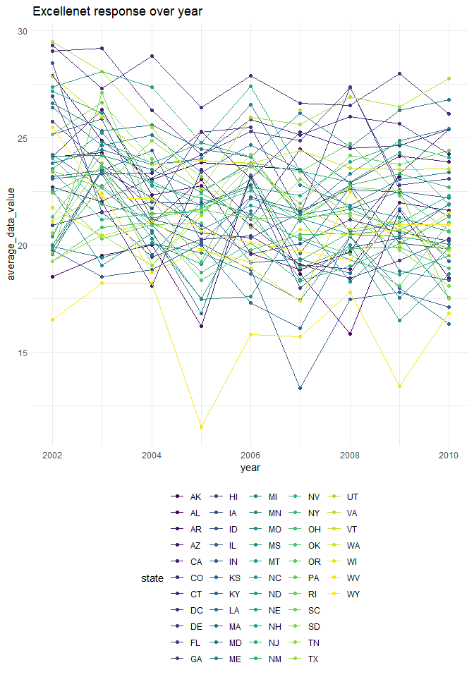
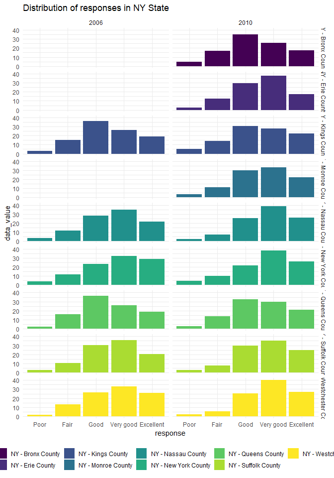

p8105\_hw3\_jz3425
================
Jibei Zheng
10/17/2021

``` r
library(tidyverse)
library(p8105.datasets)

theme_set(theme_minimal() + theme(legend.position = "bottom"))

options(
  ggplot2.continuous.colour = "viridis",
  ggplot2.continuous.fill = "viridis"
)

scale_colour_discrete = scale_colour_viridis_d
scale_fill_discrete = scale_fill_viridis_d
```

## Problem 1

Load instacart dataset.

``` r
data("instacart")

count_users = count(instacart, user_id)
```

**Description of the dataset:**

This instacart dataset is an anonymized dataset with 1384617
observations of 131209 unique users and one order from each of them.
Each row represents one product of an order. There are 15 variables. Key
variables include `user_id` and `product_id`, `add_to_cart_order`: order
in which each product was added to cart, `reordered`: if one product has
been reordered, `order_dow` and `order_hour_of_day`: day and time an
order was placed, and categories information of each product.

For example:

``` r
#example df
order_1 = instacart %>% 
  filter(order_id == 1)

knitr::kable(order_1, digits = 1)
```

| order\_id | product\_id | add\_to\_cart\_order | reordered | user\_id | eval\_set | order\_number | order\_dow | order\_hour\_of\_day | days\_since\_prior\_order | product\_name                                 | aisle\_id | department\_id | aisle                | department   |
|----------:|------------:|---------------------:|----------:|---------:|:----------|--------------:|-----------:|---------------------:|--------------------------:|:----------------------------------------------|----------:|---------------:|:---------------------|:-------------|
|         1 |       49302 |                    1 |         1 |   112108 | train     |             4 |          4 |                   10 |                         9 | Bulgarian Yogurt                              |       120 |             16 | yogurt               | dairy eggs   |
|         1 |       11109 |                    2 |         1 |   112108 | train     |             4 |          4 |                   10 |                         9 | Organic 4% Milk Fat Whole Milk Cottage Cheese |       108 |             16 | other creams cheeses | dairy eggs   |
|         1 |       10246 |                    3 |         0 |   112108 | train     |             4 |          4 |                   10 |                         9 | Organic Celery Hearts                         |        83 |              4 | fresh vegetables     | produce      |
|         1 |       49683 |                    4 |         0 |   112108 | train     |             4 |          4 |                   10 |                         9 | Cucumber Kirby                                |        83 |              4 | fresh vegetables     | produce      |
|         1 |       43633 |                    5 |         1 |   112108 | train     |             4 |          4 |                   10 |                         9 | Lightly Smoked Sardines in Olive Oil          |        95 |             15 | canned meat seafood  | canned goods |
|         1 |       13176 |                    6 |         0 |   112108 | train     |             4 |          4 |                   10 |                         9 | Bag of Organic Bananas                        |        24 |              4 | fresh fruits         | produce      |
|         1 |       47209 |                    7 |         0 |   112108 | train     |             4 |          4 |                   10 |                         9 | Organic Hass Avocado                          |        24 |              4 | fresh fruits         | produce      |
|         1 |       22035 |                    8 |         1 |   112108 | train     |             4 |          4 |                   10 |                         9 | Organic Whole String Cheese                   |        21 |             16 | packaged cheese      | dairy eggs   |

These rows show an order from user 112108 of 8 products by the order in
which they were added to the cart, each with name, aisle and department
information. The order was placed on Thursday 10(in 24 hour system). 4
products were reordered. It had been 9 days since the last order of this
user.

**·How many aisles are there, and which aisles are the most items
ordered from?**

``` r
count_aisle = 
  instacart %>% 
  group_by(aisle) %>% 
  summarize(n_obs = n()) %>% 
  arrange(desc(n_obs))
count_aisle
```

    ## # A tibble: 134 x 2
    ##    aisle                          n_obs
    ##    <chr>                          <int>
    ##  1 fresh vegetables              150609
    ##  2 fresh fruits                  150473
    ##  3 packaged vegetables fruits     78493
    ##  4 yogurt                         55240
    ##  5 packaged cheese                41699
    ##  6 water seltzer sparkling water  36617
    ##  7 milk                           32644
    ##  8 chips pretzels                 31269
    ##  9 soy lactosefree                26240
    ## 10 bread                          23635
    ## # ... with 124 more rows

There are 134 aisles, and fresh vegetables are the most items ordered
from.

**·Make a plot that shows the number of items ordered in each aisle,
limiting this to aisles with more than 10000 items ordered. Arrange
aisles sensibly, and organize your plot so others can read it.**

``` r
count_aisle %>% 
  filter(n_obs > 10000) %>% 
  mutate(aisle = fct_reorder(aisle, n_obs)) %>% 
  ggplot(aes(x = n_obs, y = aisle)) +
  geom_col() +
  labs(
    title = "Aisle Plot",
    x = "Number of items ordered",
    y = "Aisle"
  ) +
  scale_x_continuous(breaks = c(10000, 30000, 50000, 80000, 150000))
```

<!-- -->

There are 39 aisles with more than 10000 items ordered, among which
fresh vegetables and fresh fruits are the most popular with more than
150000 orders.

**·Make a table showing the three most popular items in each of the
aisles “baking ingredients”, “dog food care”, and “packaged vegetables
fruits”. Include the number of times each item is ordered in your
table.**

``` r
instacart %>% 
  filter(aisle %in% c("baking ingredients", "dog food care", "packaged vegetables fruits")) %>% 
  group_by(aisle, product_name) %>% 
  summarize(n_items = n()) %>% 
  filter(min_rank(desc(n_items)) < 4) %>% 
  arrange(desc(n_items), .by_group = TRUE) %>% 
  knitr::kable(digits = 1)
```

| aisle                      | product\_name                                 | n\_items |
|:---------------------------|:----------------------------------------------|---------:|
| baking ingredients         | Light Brown Sugar                             |      499 |
| baking ingredients         | Pure Baking Soda                              |      387 |
| baking ingredients         | Cane Sugar                                    |      336 |
| dog food care              | Snack Sticks Chicken & Rice Recipe Dog Treats |       30 |
| dog food care              | Organix Chicken & Brown Rice Recipe           |       28 |
| dog food care              | Small Dog Biscuits                            |       26 |
| packaged vegetables fruits | Organic Baby Spinach                          |     9784 |
| packaged vegetables fruits | Organic Raspberries                           |     5546 |
| packaged vegetables fruits | Organic Blueberries                           |     4966 |

Among these three aisles, the most popular one is packaged vegetables
fruits, each product with thousands of orders; the least popular one is
dog food care, each product with only less than 30 orders, probably
because they are less frequently needed.

``` r
#generate a plot
instacart %>% 
  filter(aisle %in% c("baking ingredients", "dog food care", "packaged vegetables fruits")) %>% 
  group_by(aisle, product_name) %>% 
  summarize(n_items = n()) %>% 
  filter(min_rank(desc(n_items)) < 4) %>% 
  mutate(product_name = fct_reorder(product_name, n_items)) %>% 
  ggplot(aes(y = product_name, x = n_items, fill = aisle)) +
  geom_col() +
  labs(
    title = "Most Popular Items",
    x = "Number of items ordered",
    y = "Item"
  ) +
  scale_x_continuous(
    trans = "sqrt",
    breaks = c(30, 400, 5000, 10000)
  ) +
  facet_grid(aisle ~ ., scales = "free_y")
```

<!-- -->

**·Make a table showing the mean hour of the day at which Pink Lady
Apples and Coffee Ice Cream are ordered on each day of the week; format
this table for human readers (i.e. produce a 2 x 7 table).**

``` r
dow = c("monday", "tuesday", "wednesday", "thursday", "friday", "saturday", "sunday")

instacart %>% 
  filter(product_name %in% c("Pink Lady Apples", "Coffee Ice Cream")) %>% 
  select(product_name, order_dow, order_hour_of_day) %>% 
  group_by(product_name, order_dow) %>% 
  summarize(mean_hour = mean(order_hour_of_day)) %>% 
  mutate(order_dow = dow[order_dow + 1]) %>% 
  pivot_wider(
    names_from = "order_dow",
    values_from = "mean_hour"
  ) %>% 
  knitr::kable(digits = 1)
```

| product\_name    | monday | tuesday | wednesday | thursday | friday | saturday | sunday |
|:-----------------|-------:|--------:|----------:|---------:|-------:|---------:|-------:|
| Coffee Ice Cream |   13.8 |    14.3 |      15.4 |     15.3 |   15.2 |     12.3 |   13.8 |
| Pink Lady Apples |   13.4 |    11.4 |      11.7 |     14.2 |   11.6 |     12.8 |   11.9 |

On most of the days, people buy coffee ice creams a little later than
pink lady apples, conforming to the finding that healthier food tends to
be purchased earlier in the day.

## Problem 2

Load BRFSS SMART 2010 data and clean it.

``` r
data("brfss_smart2010")

brfss_df = 
  brfss_smart2010 %>% 
  janitor::clean_names() %>% 
  filter(topic == "Overall Health") %>% 
  rename(state = locationabbr, county = locationdesc) %>% 
  mutate(response = factor(response, levels = c("Poor", "Fair", "Good", "Very good", "Excellent"))) 
```

**·In 2002, which states were observed at 7 or more locations? What
about in 2010?**

``` r
brfss_df %>% 
  filter(year == 2002) %>% 
  group_by(state) %>% 
  summarize(n_obs = n() / 5) %>% 
  filter(n_obs >= 7) %>% 
  knitr::kable(digits = 1)
```

| state | n\_obs |
|:------|-------:|
| CT    |      7 |
| FL    |      7 |
| MA    |      8 |
| NC    |      7 |
| NJ    |      8 |
| PA    |     10 |

There were 6 states listed above which observed at 7 or more locations.

``` r
brfss_df %>% 
  filter(year == 2010) %>% 
  group_by(state) %>% 
  summarize(n_obs = n() / 5) %>% 
  filter(n_obs >= 7) %>% 
  knitr::kable(digits = 1)
```

| state | n\_obs |
|:------|-------:|
| CA    |     12 |
| CO    |      7 |
| FL    |     41 |
| MA    |      9 |
| MD    |     12 |
| NC    |     12 |
| NE    |     10 |
| NJ    |     19 |
| NY    |      9 |
| OH    |      8 |
| PA    |      7 |
| SC    |      7 |
| TX    |     16 |
| WA    |     10 |

There were 14 states listed above which observed at 7 or more locations,
8 more than 2002.

**Construct a dataset that is limited to Excellent responses, and
contains, year, state, and a variable that averages the data\_value
across locations within a state. Make a “spaghetti” plot of this average
value over time within a state.**

``` r
excellent_df =
  brfss_df %>% 
  filter(response == "Excellent") %>% 
  group_by(year, state) %>% 
  summarize(average_data_value = mean(data_value))

excellent_df
```

    ## # A tibble: 443 x 3
    ## # Groups:   year [9]
    ##     year state average_data_value
    ##    <int> <chr>              <dbl>
    ##  1  2002 AK                  27.9
    ##  2  2002 AL                  18.5
    ##  3  2002 AR                  24.1
    ##  4  2002 AZ                  24.1
    ##  5  2002 CA                  22.7
    ##  6  2002 CO                  23.1
    ##  7  2002 CT                  29.1
    ##  8  2002 DC                  29.3
    ##  9  2002 DE                  20.9
    ## 10  2002 FL                  25.7
    ## # ... with 433 more rows

``` r
excellent_df %>% 
  ggplot(aes(x = year, y = average_data_value, color = state)) +
  geom_line()
```

<!-- -->

Maybe it’s a bad idea to put all the lines in one plot.

**Make a two-panel plot showing, for the years 2006, and 2010,
distribution of data\_value for responses(“Poor” to “Excellent”) among
locations in NY State.**

``` r
brfss_df %>% 
  filter(state == "NY") %>% 
  filter(year %in% c(2010, 2006)) %>% 
  select(year, county, response, data_value) %>% 
  ggplot(aes(x = response, y = data_value, color = county, group = 1)) +
  geom_point() +
  geom_line() +
  facet_grid(county ~ year)
```

<!-- -->

## Problem 3

Load and tidy accel\_data.

``` r
accel_df = 
  read.csv(file = "./data/accel_data.csv") %>% 
  janitor::clean_names() %>% 
  mutate(
    day_type = case_when(
      day == "Saturday" | day == "Sunday" ~ "weekend",
      TRUE ~ "weekday"
    ),
    day = str_to_lower(day),
  ) %>% 
  rename(week_id = week) %>% 
  pivot_longer(
    activity_1:activity_1440,
    names_to = "minute_id",
    names_prefix = "activity_",
    values_to = "activity"
  )

accel_df
```

    ## # A tibble: 50,400 x 6
    ##    week_id day_id day    day_type minute_id activity
    ##      <int>  <int> <chr>  <chr>    <chr>        <dbl>
    ##  1       1      1 friday weekday  1             88.4
    ##  2       1      1 friday weekday  2             82.2
    ##  3       1      1 friday weekday  3             64.4
    ##  4       1      1 friday weekday  4             70.0
    ##  5       1      1 friday weekday  5             75.0
    ##  6       1      1 friday weekday  6             66.3
    ##  7       1      1 friday weekday  7             53.8
    ##  8       1      1 friday weekday  8             47.8
    ##  9       1      1 friday weekday  9             55.5
    ## 10       1      1 friday weekday  10            43.0
    ## # ... with 50,390 more rows

This accelerometers dataset is from contains 50400 observations of
activity counts for each minute of a 24-hour dayx starting at
midnight(1440 per day) within 5 weeks(35 days) of a 63 year-old male
with BMI 25. There are 6 variables including week id, day id, minute id
and most important, activity. Not very sure why the days are in weird
order, but I decide to follow the order of day\_id first, and I will
reorder them chronologically in next steps.

**Aggregate accross minutes to create a total activity variable for each
day, and create a table showing these totals.**

``` r
#plot in day_id order
accel_df %>% 
  group_by(day_id) %>% 
  summarize(total_activity = sum(activity)) %>% 
  ggplot(aes(x = day_id, y = total_activity)) +
  geom_point() +
  geom_line() +
  labs(
    title = "Total activity plot in day_id order",
    x = "Day",
    y = "Total Activity"
  ) +
  scale_x_continuous(
    breaks = c(7, 14, 21, 28, 35)
  )
```

<!-- -->

``` r
#plot in chronological order
accel_df %>% 
  mutate(day = factor(day, levels = c("monday", "tuesday", "wednesday", "thursday", "friday", "saturday", "sunday"))) %>% 
  arrange(week_id, day) %>% 
  group_by(week_id, day) %>% 
  summarize(total_activity = sum(activity)) %>% 
  ungroup() %>% 
  mutate(day_id = c(1:35)) %>% 
  ggplot(aes(y = total_activity, x = day_id)) +
  geom_point() +
  geom_line() +
  labs(
    title = "Total activity plot in chronological order",
    x = "Day",
    y = "Total Activity"
  ) +
  scale_x_continuous(
    breaks = c(7, 14, 21, 28, 35)
  )
```

<!-- -->

Both plots do not show apparent trends.
